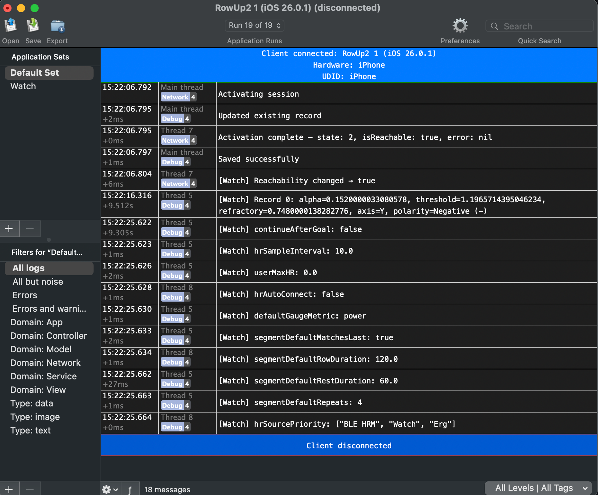

# NSWatchLogger

A lightweight logging library for watchOS that sends structured log entries to a companion macOS viewer over the local network. Supports two transport modes: direct HTTP/WebSocket over Bonjour, and WatchConnectivity relay through the paired iPhone.

No external dependencies. Pure Swift.

## Using with NSLogger



## Products

- **NSWatchLogger** — Core logger enum + transport protocol. Import on watchOS.
- **NSWatchLoggerDirect** — Direct network transport (HTTP or WebSocket) with Bonjour discovery. Import on watchOS when sending logs directly to the macOS viewer without an iPhone relay.
- **NSWatchLoggerModels** — Shared `LogEntry` model and Bonjour constants. Used by both client and server.
- **NSWatchLoggerServer** — HTTP + WebSocket listener with Bonjour advertising. Used by the macOS viewer app and the CLI.
- **NSWatchLoggerRelay** — WatchConnectivity payload receiver + sink protocol. Import on iOS for the relay path.
- **LogServerCLI** — Standalone command-line log server for headless use.

## Architecture

```
watchOS App                         macOS
+--------------+    HTTP/WS     +------------------+
| WatchLogger  | ------------> | NSWatchLogViewer   |
| + Direct     |   Bonjour     | (or LogServerCLI) |
|   Transport  |   discovery   +------------------+
+--------------+

        -- or --

watchOS App        WCSession       iOS App          sink
+--------------+ -----------> +--------------+ ----------->
| WatchLogger  |              | WatchLogRelay|   NSLogger,
| + WC relay   |              |              |   os_log, etc.
+--------------+              +--------------+
```

## Direct Transport (HTTP/WebSocket)

Sends logs straight from the Watch to the macOS viewer over the local network. No iPhone needed. Best when the Watch and Mac are on the same network.

### Watch Side

```swift
import NSWatchLogger
import NSWatchLoggerDirect

// Create a direct transport (auto-discovers the viewer via Bonjour)
let transport = DirectLogTransport.create(mode: .http)

// Or connect to a known host
let transport = DirectLogTransport.create(mode: .http, host: "192.168.1.50", port: 9830)

// Configure the logger
WatchLogger.configure(transport: transport, enabled: true)

// Optionally filter out noisy levels on the device
WatchLogger.configure(transport: transport, enabled: true, minimumLevel: .warning)

// Log from anywhere
WatchLogger.log(.network, .debug, "GET /api/health 200")
WatchLogger.log(.workout, .info, "Session started")
WatchLogger.log(.network, .warning, "Request timeout after 30s")
WatchLogger.log(.custom("rowing"), .error, "Sensor disconnected")
```

### Connection Status

```swift
transport.onConnectionStatusChanged = { status in
    // .disconnected, .discovering, .connecting, .connected
    print("Transport: \(status)")
}
```

### Transport Modes

- **`.http`** — One request per log entry (or batched). Simple, works through firewalls. Default port 9830.
- **`.webSocket`** — Persistent connection, lower overhead for high-frequency logging. Port 9831 (9830 + 1).

Both modes use Bonjour (`_watchlog._tcp`) to auto-discover the viewer on the local network.

## WatchConnectivity Relay

Routes logs through the paired iPhone using WCSession. The natural choice when your app already has a companion iOS app, and lets you pipe logs into NSLogger, os_log, or any logging backend on the phone. Also works when the Watch and Mac are not on the same network.

### Watch Side

```swift
import NSWatchLogger

WatchLogger.configure(transport: wcManager, enabled: true)

WatchLogger.log(.network, .debug, "Reachability changed")
```

Your `WatchConnectivityManager` conforms to `WatchLogTransport`:

```swift
extension WatchConnectivityManager: WatchLogTransport {
    public func sendLog(payload: [String: Any]) {
        guard WCSession.default.isReachable else { return }
        WCSession.default.sendMessage(payload, replyHandler: nil) { _ in }
    }
}
```

### iPhone Side

```swift
import NSWatchLoggerRelay

struct MyLogSink: WatchLogSink {
    func log(domain: String, level: String, message: String) {
        // Route to NSLogger, os_log, swift-log, print, etc.
    }
}

WatchLogRelay.configure(sink: MyLogSink())

// In WCSession delegate:
if message["type"] as? String == "watchLog" {
    WatchLogRelay.process(message)
}
```

## Log Level Filtering

Set a minimum level on the client side to suppress noisy logs before they hit the network. Entries below the threshold are dropped entirely (not sent, not printed).

```swift
// At configure time
WatchLogger.configure(transport: transport, enabled: true, minimumLevel: .info)

// Or change at runtime
WatchLogger.minimumLevel = .warning  // only warning + error from now on
WatchLogger.minimumLevel = .debug    // back to everything
```

Level ordering: `.debug` < `.info` < `.warning` < `.error`

## Log Entry Format

Entries are sent as JSON with ISO 8601 timestamps. The timestamp is captured on the Watch at call time for accurate timing.

```json
{
  "id": "A1B2C3D4-...",
  "timestamp": "2026-05-22T01:30:00Z",
  "tag": "network",
  "level": "debug",
  "message": "GET /api/health 200",
  "sessionID": "E5F6A7B8-...",
  "deviceName": "Fernando's Apple Watch"
}
```

## Tags

Built-in: `.network`, `.workout`, `.service`, `.debug`
Custom: `.custom("yourTag")`

## Levels

`.debug`, `.info`, `.warning`, `.error`

## Thread Safety

`WatchLogger`, `WatchLogRelay`, `DirectLogTransport`, and `LogServer` use `NSLock` to guard mutable state. Safe to call from any thread.

## Design Decisions

- **Transport protocol** — No WCSession dependency in the core library. The `WatchLogTransport` protocol keeps it decoupled so you can swap between direct and relay transports.
- **Direct transport with queuing** — `DirectLogTransport` queues entries when disconnected and flushes on reconnect. No logs are lost during brief network interruptions.
- **Bonjour discovery** — Zero-configuration. The viewer advertises `_watchlog._tcp`, the Watch finds it automatically.
- **Client-side timestamps** — `LogEntry.timestamp` is set when `log()` is called, not when the server receives it. This gives accurate timing for performance debugging.
- **Client-side level filtering** — Filtering happens before serialization and network send, saving battery and bandwidth on the Watch.
- **Two separate viewer options** — `NSWatchLogViewer` (macOS app with GUI) or `LogServerCLI` (headless, for scripting and CI).
