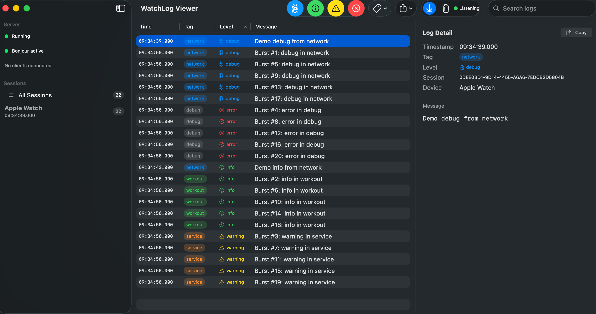

# NSWatchLogger

A lightweight logging library for watchOS that sends structured log entries to a companion macOS viewer over the local network. Supports two transport paths: direct HTTP to the viewer, and WatchConnectivity relay through the paired iPhone.

No external dependencies. Pure Swift.

## Using with NSLogger when you have a companion iOS app


## Using with NSWatchLogViewer with watch only app



## Products

- **NSWatchLogger** — Core logger enum + transport protocol. Import on watchOS.
- **NSWatchLoggerDirect** — Direct HTTP transport. Import on watchOS when sending logs directly to the macOS viewer without an iPhone relay.
- **NSWatchLoggerModels** — Shared `LogEntry` model and constants. Used by both client and server.
- **NSWatchLoggerServer** — HTTP listener with Bonjour advertising. Used by the macOS viewer app and the CLI.
- **NSWatchLoggerRelay** — WatchConnectivity payload receiver + sink protocol. Import on iOS for the relay path.
- **LogServerCLI** — Standalone command-line log server for headless use.

## Architecture

```
watchOS App                         macOS
+--------------+      HTTP      +------------------+
| WatchLogger  | ------------> | NSWatchLogViewer   |
| + Direct     |               | (or LogServerCLI) |
|   Transport  |               +------------------+
+--------------+

        -- or --

watchOS App        WCSession       iOS App          sink
+--------------+ -----------> +--------------+ ----------->
| WatchLogger  |              | WatchLogRelay|   NSLogger,
| + WC relay   |              |              |   os_log, etc.
+--------------+              +--------------+
```

## watchOS Network Limitations

watchOS restricts all networking below HTTP/HTTPS (raw TCP, WebSocket, Bonjour discovery) via NECP policy. Only `URLSession` HTTP requests are allowed. This means:

- The server host IP must be provided explicitly (no auto-discovery)
- WebSocket and raw TCP transports are not available on watchOS
- The Watch and Mac must be on the same local network

## Direct Transport (HTTP)

Sends logs straight from the Watch to the macOS viewer over HTTP. No iPhone needed. The Watch and Mac must be on the same network.

### Watch Side

```swift
import NSWatchLogger
import NSWatchLoggerDirect

// Create a direct transport with the viewer's IP
let transport = DirectLogTransport.create(host: "192.168.1.50")

// Or specify a custom port (default is 9830)
let transport = DirectLogTransport.create(host: "192.168.1.50", port: 9830)

// Configure the logger
WatchLogger.configure(transport: transport, enabled: true)

// Optionally filter out noisy levels on the device
WatchLogger.configure(transport: transport, enabled: true, minimumLevel: .warning)

// Log from anywhere
WatchLogger.log(.network, .debug, "GET /api/health 200")
WatchLogger.log(.workout, .info, "Session started")
WatchLogger.log(.network, .warning, "Request timeout after 30s")
WatchLogger.log(.custom("rowing"), .error, "Sensor disconnected")
```

### Connection Status

```swift
transport.onConnectionStatusChanged = { status in
    // .disconnected, .connecting, .connected, .reconnecting
    print("Transport: \(status)")
}
```

## WatchConnectivity Relay

Routes logs through the paired iPhone using WCSession. The natural choice when your app already has a companion iOS app, and lets you pipe logs into NSLogger, os_log, or any logging backend on the phone. Also works when the Watch and Mac are not on the same network.

### Watch Side

```swift
import NSWatchLogger

WatchLogger.configure(transport: wcManager, enabled: true)

WatchLogger.log(.network, .debug, "Reachability changed")
```

Your `WatchConnectivityManager` conforms to `WatchLogTransport`:

```swift
extension WatchConnectivityManager: WatchLogTransport {
    public func sendLog(payload: [String: Any]) {
        guard WCSession.default.isReachable else { return }
        WCSession.default.sendMessage(payload, replyHandler: nil) { _ in }
    }
}
```

### iPhone Side

```swift
import NSWatchLoggerRelay

struct MyLogSink: WatchLogSink {
    func log(domain: String, level: String, message: String) {
        // Route to NSLogger, os_log, swift-log, print, etc.
    }
}

WatchLogRelay.configure(sink: MyLogSink())

// In WCSession delegate:
if message["type"] as? String == "watchLog" {
    WatchLogRelay.process(message)
}
```

## Log Level Filtering

Set a minimum level on the client side to suppress noisy logs before they hit the network. Entries below the threshold are dropped entirely (not sent, not printed).

```swift
// At configure time
WatchLogger.configure(transport: transport, enabled: true, minimumLevel: .info)

// Or change at runtime
WatchLogger.minimumLevel = .warning  // only warning + error from now on
WatchLogger.minimumLevel = .debug    // back to everything
```

Level ordering: `.debug` < `.info` < `.warning` < `.error`

## Log Entry Format

Entries are sent as JSON with ISO 8601 timestamps. The timestamp is captured on the Watch at call time for accurate timing.

```json
{
  "id": "A1B2C3D4-...",
  "timestamp": "2026-05-22T01:30:00Z",
  "tag": "network",
  "level": "debug",
  "message": "GET /api/health 200",
  "sessionID": "E5F6A7B8-...",
  "deviceName": "Fernando's Apple Watch"
}
```

## Tags

Built-in: `.network`, `.workout`, `.service`, `.debug`
Custom: `.custom("yourTag")`

## Levels

`.debug`, `.info`, `.warning`, `.error`

## LogServerCLI

A headless log server you can run from the terminal. Listens for incoming logs over HTTP, advertises via Bonjour, and prints entries to stdout. Useful for scripting, CI, or when you don't need the full macOS viewer.

```bash
# Build and run
swift run LogServerCLI
```

```
LogServer running
  HTTP:       http://localhost:9830/log
  HTTP batch: http://localhost:9830/logs
  Bonjour:    advertising as _watchlog._tcp

Press Ctrl+C to stop
```

Output format:

```
[2026-05-22T01:30:00Z] [network] [debug] GET /api/health 200
[2026-05-22T01:30:01Z] [workout] [info] Session started
```

## Thread Safety

`WatchLogger`, `WatchLogRelay`, `DirectLogTransport`, and `LogServer` use `NSLock` to guard mutable state. Safe to call from any thread.

## Design Decisions

- **Transport protocol** — No WCSession dependency in the core library. The `WatchLogTransport` protocol keeps it decoupled so you can swap between direct and relay transports.
- **Direct transport with queuing** — `DirectLogTransport` queues entries when disconnected and flushes on reconnect. No logs are lost during brief network interruptions.
- **HTTP-only on watchOS** — watchOS NECP policy blocks all networking below HTTP/HTTPS (raw TCP, WebSocket, Bonjour discovery). The direct transport uses `URLSession` HTTP requests, the only networking API fully supported on watchOS.
- **Explicit host required** — Bonjour discovery is blocked on watchOS, so the server IP must be provided at configure time.
- **Client-side timestamps** — `LogEntry.timestamp` is set when `log()` is called, not when the server receives it. This gives accurate timing for performance debugging.
- **Client-side level filtering** — Filtering happens before serialization and network send, saving battery and bandwidth on the Watch.
- **Two separate viewer options** — `NSWatchLogViewer` (macOS app with GUI) or `LogServerCLI` (headless, for scripting and CI).
